# CRC-TME: Computational pathology analysis of tumour microenvironment states in colorectal cancer

## Overview

This project investigates whether quantitative morphology and nuclear architecture can resolve biologically meaningful tissue states within the colorectal tumour microenvironment.

Using H&E-stained image patches from the CRC-VAL-HE-7K dataset, an integrated feature space was constructed from classical morphology descriptors and nucleus-derived measurements. This representation was used to classify colorectal tissue compartments, construct morphology atlases, identify tumour–stroma interface regions, derive continuous morphology progression trajectories, quantify immune-associated tumour states, and investigate relationships between tumour progression and immune proximity.

The analysis demonstrates that colorectal tissue morphology occupies a structured state space in which tumour progression, stromal interaction and immune association emerge as continuous and quantifiable dimensions of tissue organisation.

Rather than treating tissue classes as isolated categories, the framework explores how tumour, stromal, immune-rich and normal epithelial states are positioned relative to one another within a shared morphology space. This allows transitional states and biologically meaningful neighbourhood relationships to be identified directly from histological appearance.

## Dataset

The analysis uses the publicly available CRC-VAL-HE-7K dataset.

| Property | Value |
|---|---|
| Dataset | CRC-VAL-HE-7K |
| Total image patches | 7,180 |
| Patch size | 224 × 224 pixels |
| Stain | H&E |
| Annotation | Expert-labelled histological tissue classes |

## Tissue classes

| Label | Description |
|---|---|
| ADI | Adipose tissue |
| BACK | Background |
| DEB | Debris |
| LYM | Lymphocytes |
| MUC | Mucus |
| MUS | Smooth muscle |
| NORM | Normal colorectal mucosa |
| STR | Tumour-associated stroma |
| TUM | Colorectal tumour epithelium |

## Dataset exploration

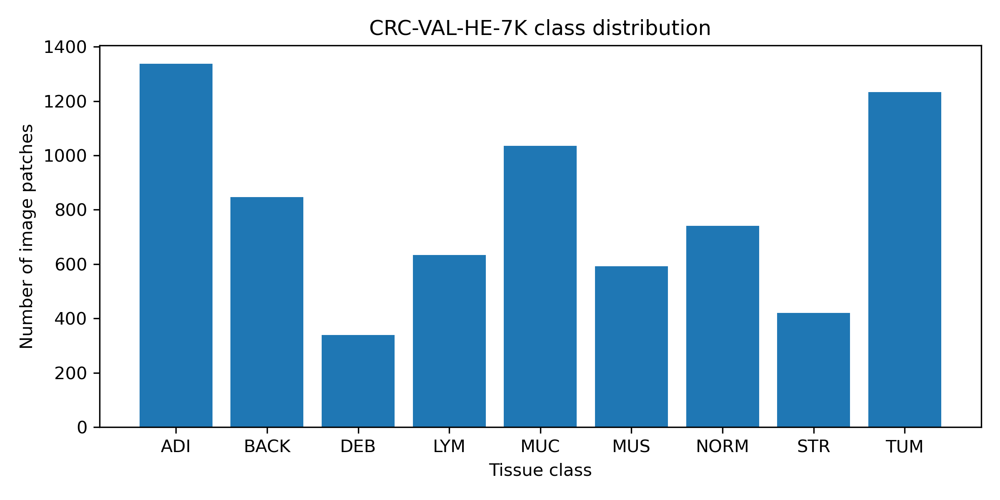

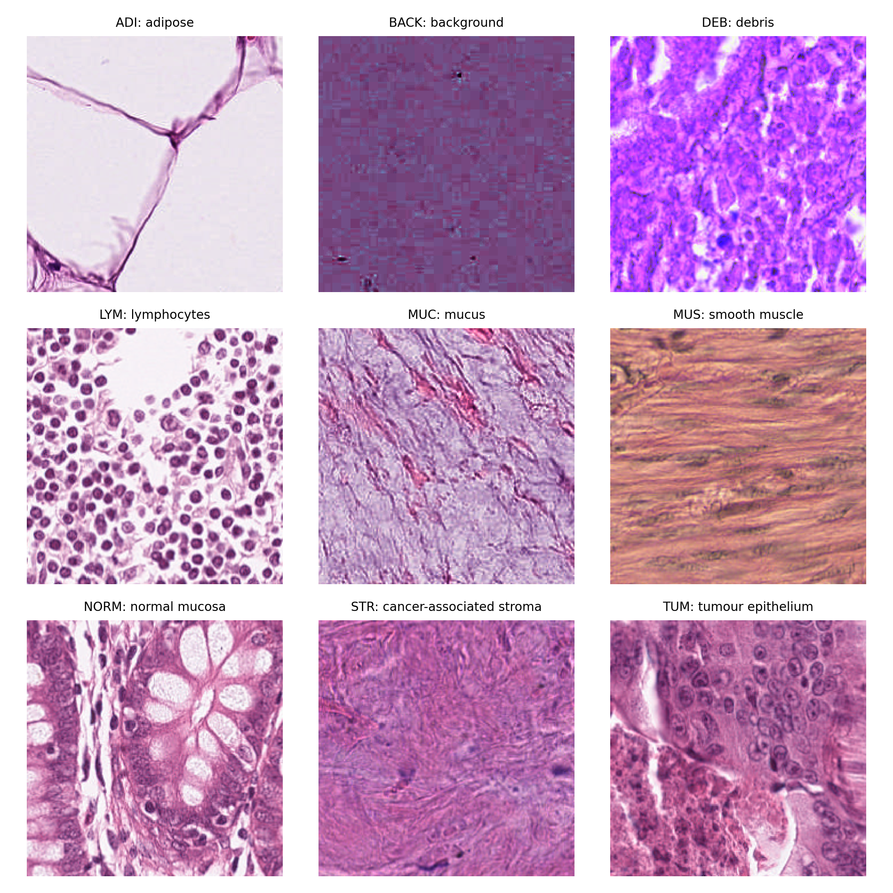

## Feature extraction

Image-level morphology descriptors were extracted from each patch, including colour intensity, intensity variation, entropy, edge density and texture-related measurements.

Nuclear morphology was quantified using classical image processing and connected-component analysis. Extracted nuclear measurements included nuclei count, nuclei density, nuclear area fraction, mean nuclear area, nuclear size variability and nuclear shape descriptors.

The final integrated feature matrix contained morphology-level and nucleus-level measurements for all 7,180 patches.

| Feature matrix | Value |
|---|---|
| Samples | 7,180 |
| Integrated features | 27 |

## Integrated morphology space

PCA and UMAP were used to visualise the integrated morphology space.

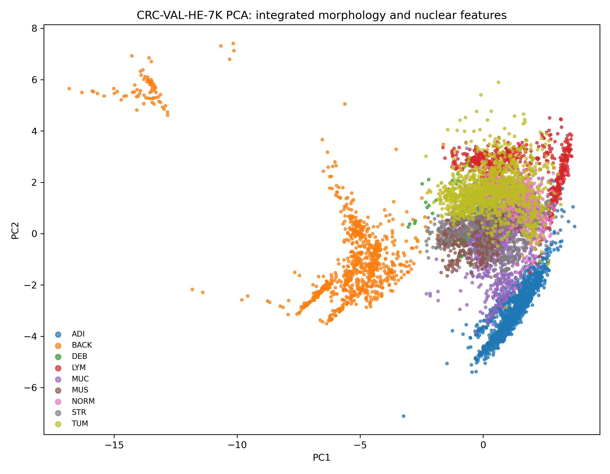

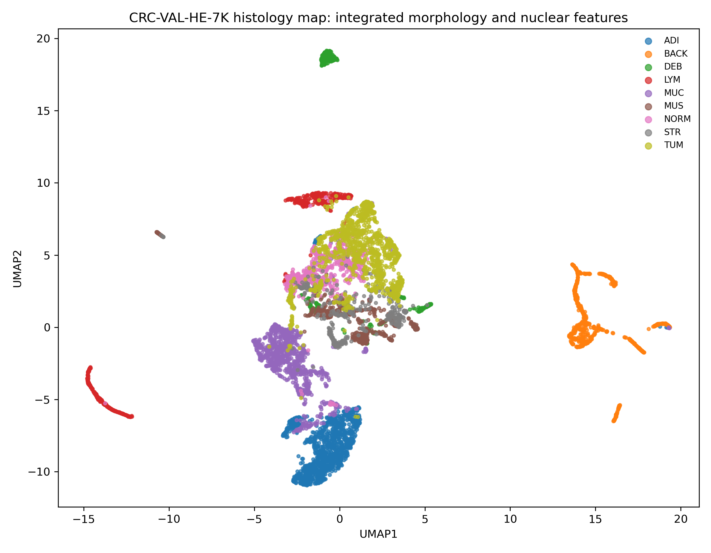

Distinct tissue territories emerge from the integrated feature representation, including lymphocyte-rich, adipose, stromal, normal mucosal and tumour-associated regions.

## Tissue classification

Random Forest classification was applied to the integrated morphology matrix.

| Metric | Value |
|---|---|
| Accuracy | 0.95 |
| Balanced accuracy | 0.949 |
| Macro F1-score | 0.95 |

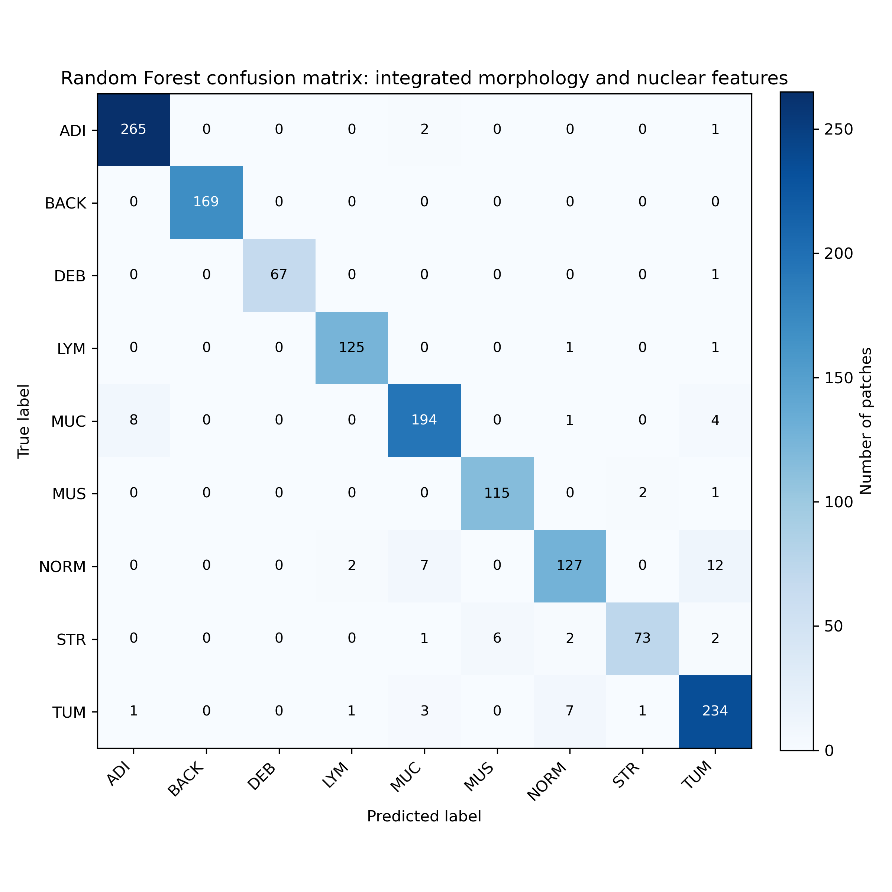

Strong separation was observed for adipose tissue, background, debris and lymphocyte-rich regions. Residual overlap occurred mainly between tumour epithelium, normal mucosa and tumour-associated stroma, consistent with biologically plausible morphological similarity between related epithelial and stromal states.

## Morphology atlas

A morphology atlas was generated by placing representative H&E patches directly into the UMAP embedding.

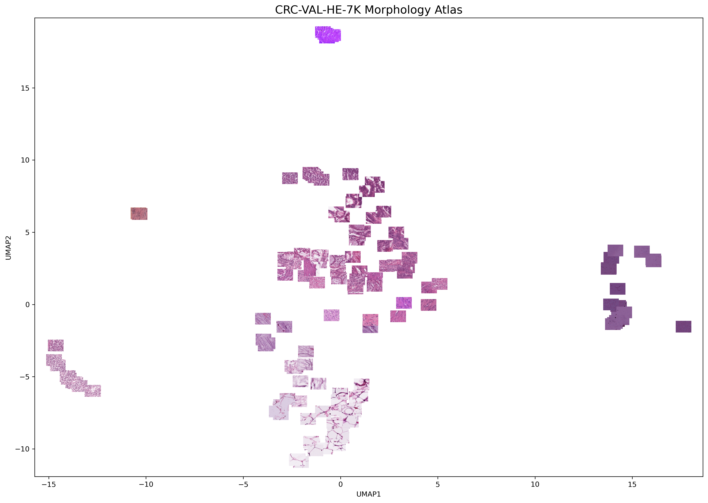

This atlas provides a visual overview of the morphology space and highlights the separation of lymphocyte-rich, adipose, background and epithelial/stromal regions.

## Tumour microenvironment subset

A focused tumour microenvironment subset was generated using four biologically relevant tissue classes:

- TUM
- STR
- LYM
- NORM

| Property | Value |
|---|---|
| Subset size | 3,029 patches |
| Classes | TUM, STR, LYM, NORM |
| Balanced accuracy | 0.947 |

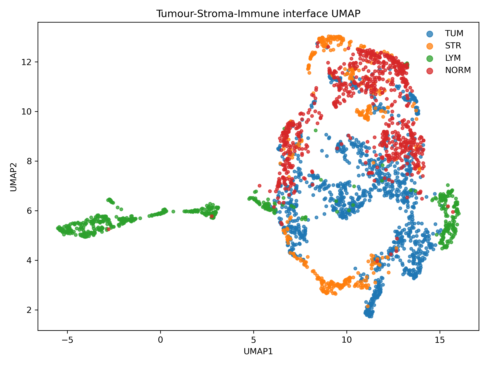

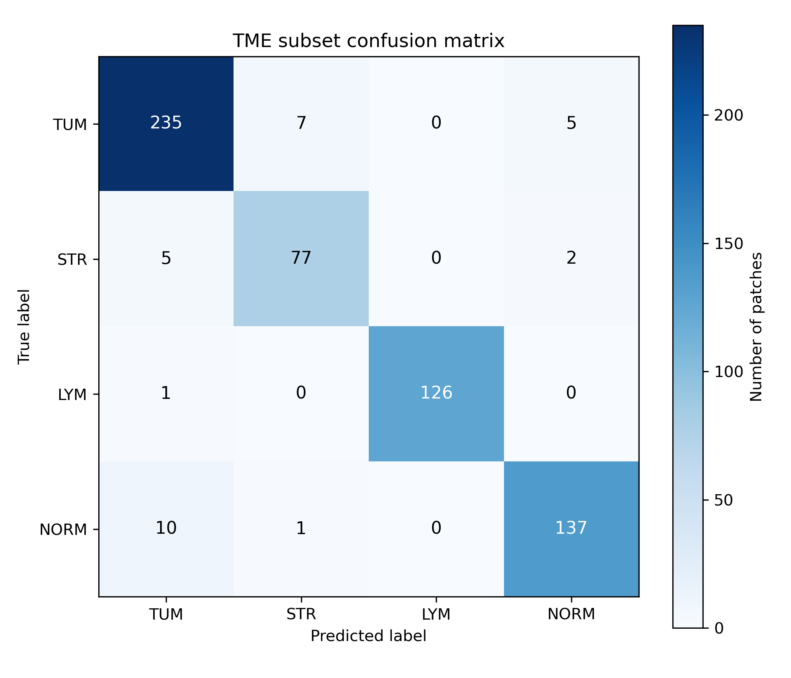

The tumour microenvironment subset reveals a structured landscape containing tumour epithelial, stromal, immune-rich and normal mucosal regions.

## Tumour-stroma interface analysis

Tumour-stroma interface patches were identified using distances within morphology space. Patches with similar distances to tumour and stromal centroids were interpreted as morphologically ambiguous interface regions.

Interface score:

`abs(distance_to_tumour - distance_to_stroma)`

Lower values indicate stronger tumour-stroma ambiguity.


Interface-associated patches frequently show disrupted glandular organisation, spindle-like stromal components, extracellular matrix-rich morphology and features consistent with invasive or reactive tumour-associated regions.

## Tumour core versus interface morphology

Tumour-core and tumour-stroma-interface patches were compared quantitatively.

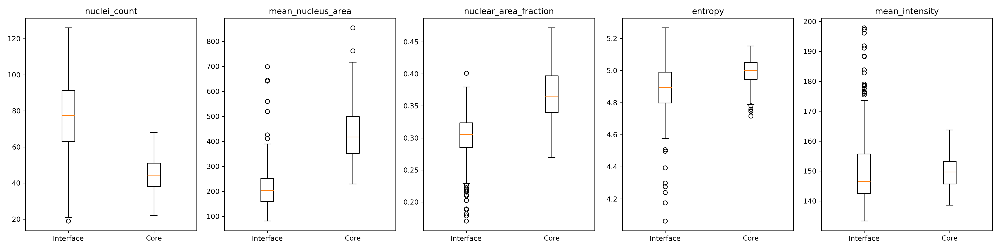

Interface-associated tumour patches showed higher nuclei counts and smaller mean nuclear area compared with tumour-core patches, suggesting a more cellular and heterogeneous local microenvironment.

| Group | Nuclei count | Mean nucleus area | Nuclear area fraction | Entropy | Mean intensity |
|---|---:|---:|---:|---:|---:|
| Core tumour | 44.36 | 437.22 | 0.369 | 4.993 | 149.67 |
| Interface tumour | 75.72 | 220.33 | 0.300 | 4.887 | 151.51 |

## Tissue neighbourhood analysis

To investigate how tissue classes are organised within morphology space, a k-nearest-neighbour graph was constructed using the integrated morphology representation.

Neighbourhood enrichment analysis was performed by comparing observed neighbour frequencies with frequencies expected from the overall class distribution.

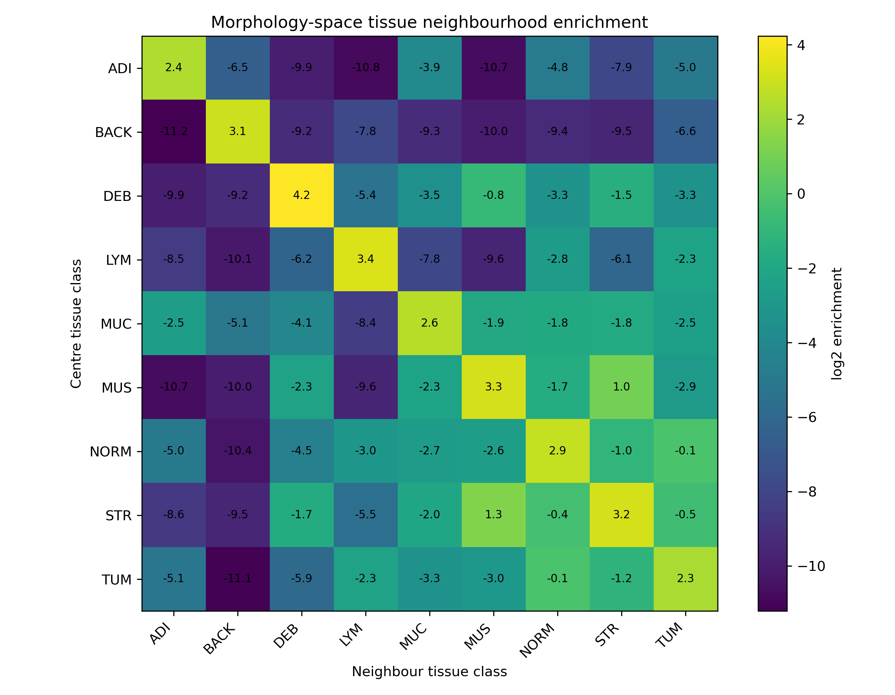

Most tissue classes displayed strong self-association, indicating that morphology space is highly structured. Among cross-class relationships, tumour-associated stroma and smooth muscle exhibited the strongest positive neighbourhood enrichment.

| Relationship | Log2 enrichment |
|---|---:|
| STR → MUS | 1.31 |
| MUS → STR | 0.99 |

These relationships are biologically plausible given the shared spindle-cell morphology and extracellular-matrix-rich architecture frequently observed in stromal and smooth-muscle regions.

The analysis suggests that the integrated feature space captures biologically meaningful relationships between tissue compartments beyond simple class separation.

## Tumour immune-proximity analysis

To investigate immune-associated tumour states, tumour patches were projected into the integrated morphology space and compared with lymphocyte-rich regions.

Immune-proximal tumour regions occupied a distinct region of morphology space characterised by differences in tissue architecture, staining intensity patterns and nuclear morphology. The observed variation extended beyond simple changes in nuclei counts and suggests broader differences in tissue organisation associated with immune-rich tumour environments.


| Score | Interpretation |
|---|---|
| Low score | Tumour-core morphology |
| Intermediate score | Mixed tumour morphology |
| High score | Immune-associated tumour morphology |

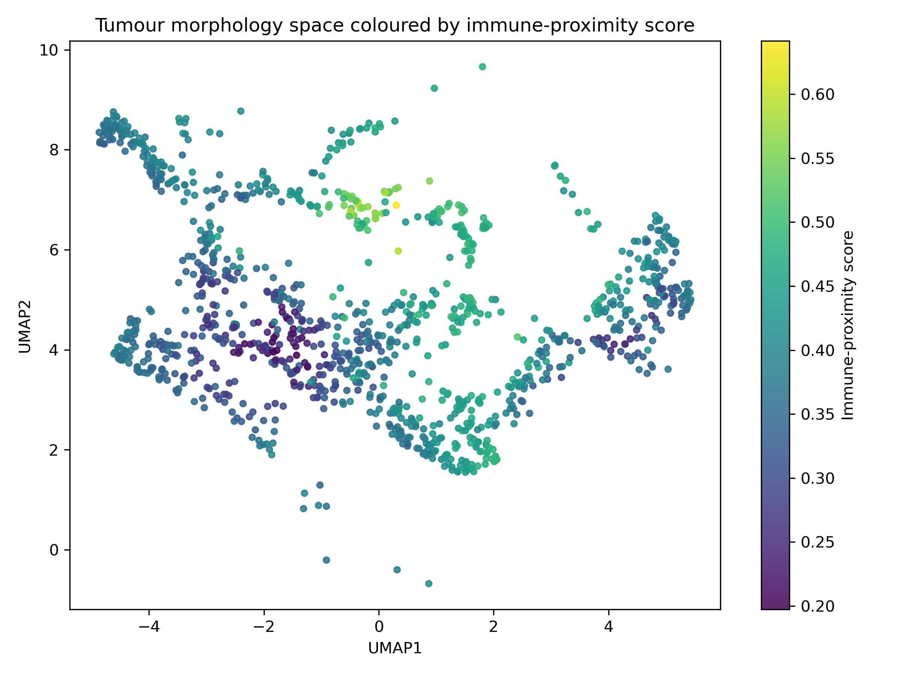

The resulting landscape revealed a continuous gradient across tumour morphology space. Rather than forming discrete classes, tumour patches occupied a spectrum ranging from tumour-core morphology to regions displaying increased similarity to lymphocyte-rich tissue.

Representative tumour patches ordered by immune-proximity score are shown below.


Immune-proximal tumour regions frequently displayed increased cellular density, greater nuclear heterogeneity and reduced glandular organisation compared with tumour-core regions, consistent with local immune infiltration or tumour–immune interaction zones.

## Tumour progression and immune proximity

Tumour progression and immune proximity were compared to test whether tumour-like morphology and immune-associated morphology represent related or divergent axes within the tumour microenvironment.

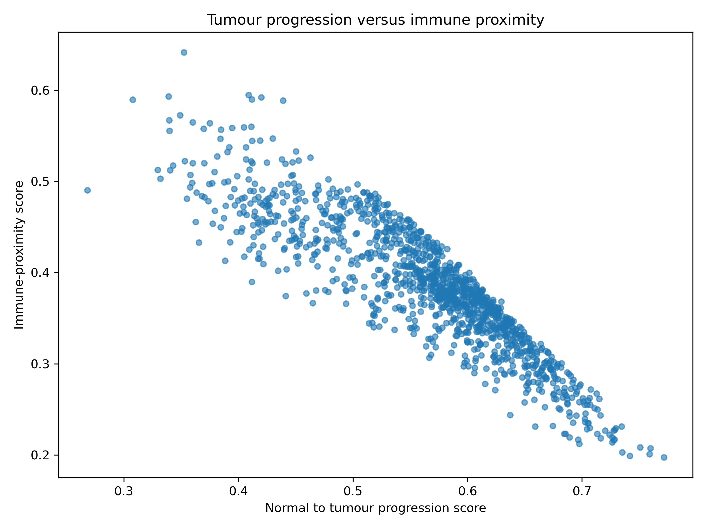

A strong negative relationship was observed between normal-to-tumour progression score and immune-proximity score across tumour patches.

| Metric | Value |
|---|---:|
| Pearson r | -0.884 |
| Spearman rho | -0.900 |
| Tumour patches | 1,233 |

This suggests that tumour-core-like morphology and immune-associated tumour morphology occupy opposing regions of the integrated morphology space. In this dataset, tumour patches with higher progression scores tended to show lower immune proximity, consistent with an immune-distant tumour-core morphology axis.

## Stromal morphology states

The tumour-associated stroma (STR) class was analysed separately to investigate whether distinct stromal morphology states could be resolved from morphology and nuclear architecture alone.

A subset of stromal patches was embedded in morphology space and partitioned into unsupervised stromal-state clusters. Representative image patches revealed three recurring stromal phenotypes:

- Cellular stroma
- Large-nucleus stroma
- Matrix-like stroma

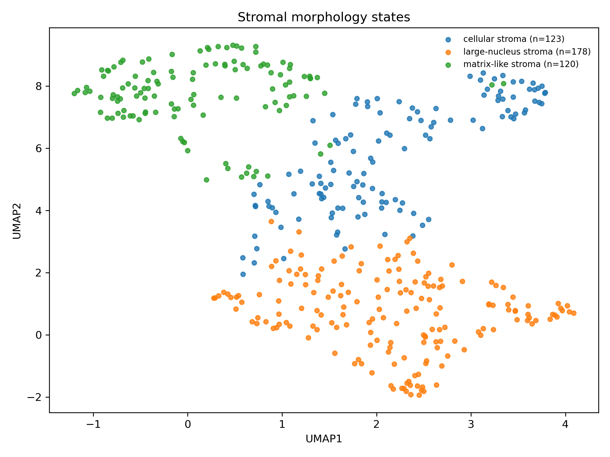

### Representative stromal states


Summary statistics:

| Stromal state | N | Mean nuclei count | Mean nucleus area | Mean intensity |
|---|---:|---:|---:|---:|
| Cellular stroma | 123 | 87.43 | 97.79 | 169.63 |
| Large-nucleus stroma | 178 | 75.49 | 180.10 | 147.24 |
| Matrix-like stroma | 120 | 54.41 | 95.26 | 183.37 |

Cellular stroma was characterised by increased nuclei density and greater local cellularity. Large-nucleus stroma showed enlarged nuclear morphology and increased nuclear area fraction. Matrix-like stroma displayed lower cellular density and brighter extracellular-matrix-rich morphology.

### Features separating stromal states

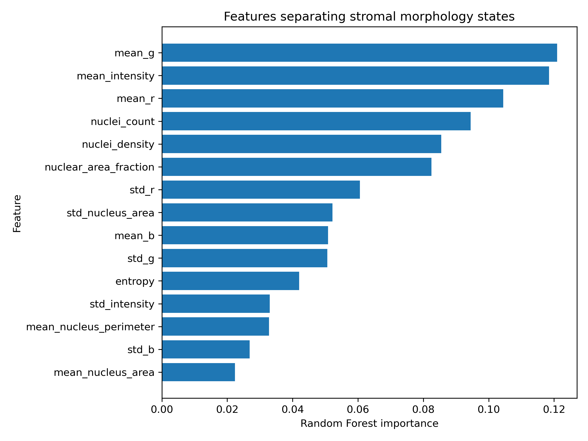

The most informative features included colour intensity, nuclei count, nuclei density, nuclear area fraction and nuclear size measurements.

Top features:

| Feature | Importance |
|---|---:|
| mean_g | 0.121 |
| mean_intensity | 0.118 |
| mean_r | 0.104 |
| nuclei_count | 0.095 |
| nuclei_density | 0.085 |
| nuclear_area_fraction | 0.083 |

These results indicate that tumour-associated stroma occupies multiple morphology states that differ in cellularity, nuclear architecture and extracellular-matrix composition, suggesting that stromal morphology states can be identified from routine H&E morphology.

## Features associated with immune proximity

To identify morphological characteristics associated with immune-associated tumour states, Random Forest regression was used to predict immune-proximity scores from integrated morphology and nuclear features.

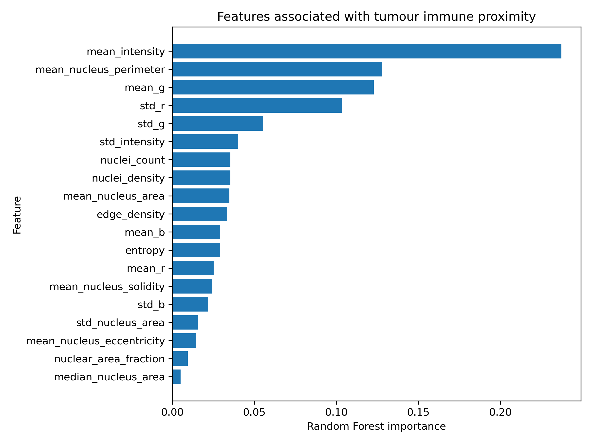

Top predictors included image-intensity measurements and nuclear morphology features.

| Feature | Importance |
|---|---:|
| Mean intensity | 0.237 |
| Mean nucleus perimeter | 0.128 |
| Mean green channel intensity | 0.123 |
| Red-channel variation | 0.103 |
| Green-channel variation | 0.056 |

Classical cellularity measurements such as nuclei count and nuclei density also contributed to prediction, but were not the dominant variables.

These findings suggest that immune-associated tumour states differ not only in cellular composition but also in broader tissue architecture and staining characteristics captured by the integrated morphology representation.

## Normal-to-tumour morphology progression axis

A continuous normal-to-tumour morphology progression score was derived from the relative position of each patch to normal and tumour centroids in the integrated feature space.

| Score | Interpretation |
|---|---|
| Low score | Normal-like morphology |
| Intermediate score | Transitional morphology |
| High score | Tumour-like morphology |

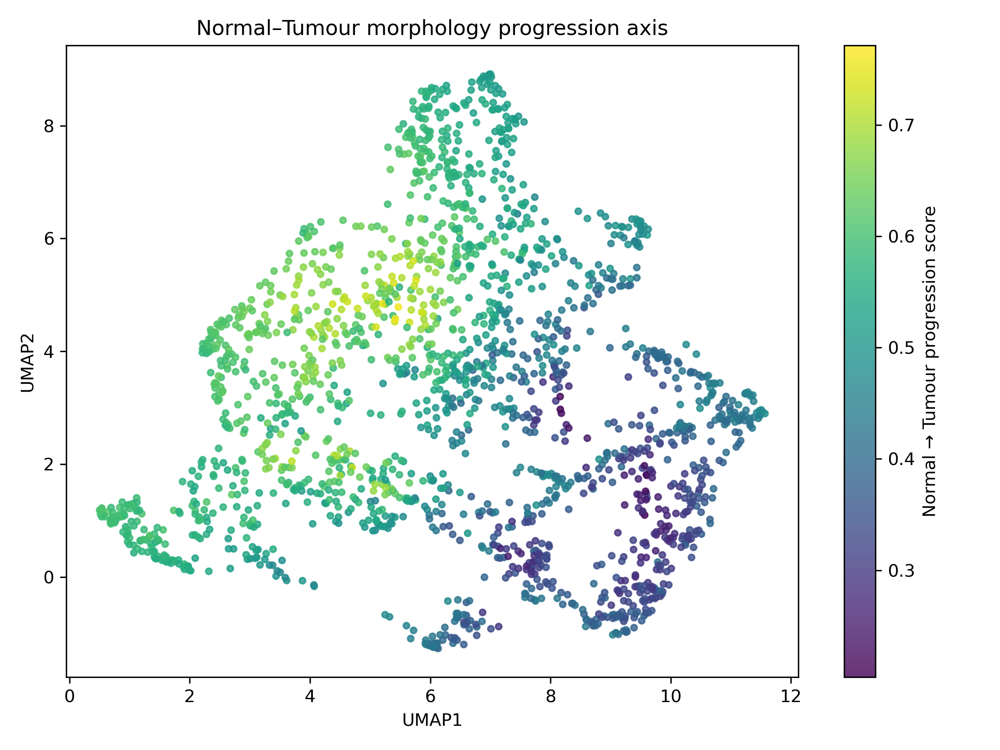

Mean progression scores:

| Class | Mean score |
|---|---:|
| NORM | 0.401 |
| TUM | 0.564 |

The overlap between normal and tumour score distributions indicates that colorectal tissue morphology is not fully discrete at patch level, but forms a continuum between normal mucosal organisation and tumour-associated morphology.

## Normal-to-tumour progression atlas

Representative patches ordered along the inferred morphology progression axis.


Low progression scores correspond to organised glandular architecture, preserved epithelial polarity and clear luminal structures. Intermediate scores show architectural distortion, increased cellular density and partial gland disruption. High scores correspond to tumour-dominated morphology with irregular gland formation, enlarged nuclei and loss of normal tissue organisation.

## Key findings

1. Integrated morphology and nuclear features achieved approximately 95% balanced classification accuracy across nine colorectal tissue compartments.

2. Nuclear architecture contributed substantially to tissue discrimination beyond image-level morphology alone.

3. Tumour, stromal and normal epithelial compartments occupied partially overlapping regions of morphology space, while adipose tissue, lymphocyte-rich regions and debris formed highly distinct territories.

4. Tumour-associated stroma was not morphologically homogeneous. Unsupervised analysis identified cellular, large-nucleus and matrix-like stromal states that differed in cellularity, nuclear morphology and extracellular-matrix appearance.

5. Tumour–stroma interface regions were identifiable as morphologically ambiguous patches located between tumour and stromal neighbourhoods in the integrated feature space.

6. Interface-associated tumour patches exhibited increased nuclei density and reduced mean nuclear area compared with tumour-core regions.

7. Colorectal tissue morphology formed a continuous progression axis extending from normal mucosa (mean score 0.401) to tumour-associated morphology (mean score 0.564).

8. Tumour morphology formed a continuous immune-proximity gradient spanning immune-associated and immune-distant tumour states.

9. Tumour progression and immune proximity were strongly negatively correlated (Pearson r = -0.884; Spearman rho = -0.900), indicating that tumour-core-like and immune-associated morphologies occupy opposing regions of morphology space.

10. Tissue-neighbourhood analysis identified biologically meaningful relationships between tissue classes, including strong enrichment between stromal and smooth-muscle regions.

11. Image-intensity and nuclear-shape features were stronger predictors of immune proximity than nuclei counts alone, suggesting that immune-associated tumour states reflect broader tissue reorganisation rather than simple changes in cellular density.

## Reproducibility

The full analysis is implemented as a Snakemake workflow.

Run the workflow:

`snakemake -s workflow/Snakefile --cores 4`

Dry run:

`snakemake -s workflow/Snakefile --cores 1 -n`


## Repository structure

```text
crc_tumour_microenvironment/
├── config/
│   └── config.yaml
├── data/
│   ├── metadata/
│   ├── processed/
│   └── raw/
├── docs/
├── envs/
├── logs/
├── results/
│   ├── figures/
│   └── tables/
├── scripts/
├── workflow/
│   └── Snakefile
├── README.md
└── LICENSE
```

## Future directions

Future work may extend the framework towards spatial tumour microenvironment modelling, including tumour–stroma interaction analysis, immune exclusion quantification, stromal activation scoring, tissue neighbourhood graphs, tumour invasion trajectories, and integration with pathology foundation models and spatial transcriptomics datasets.
